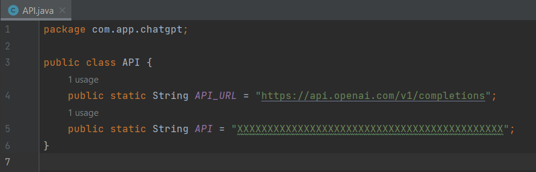
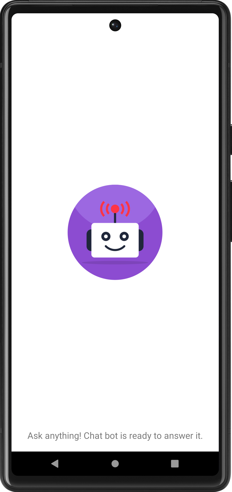
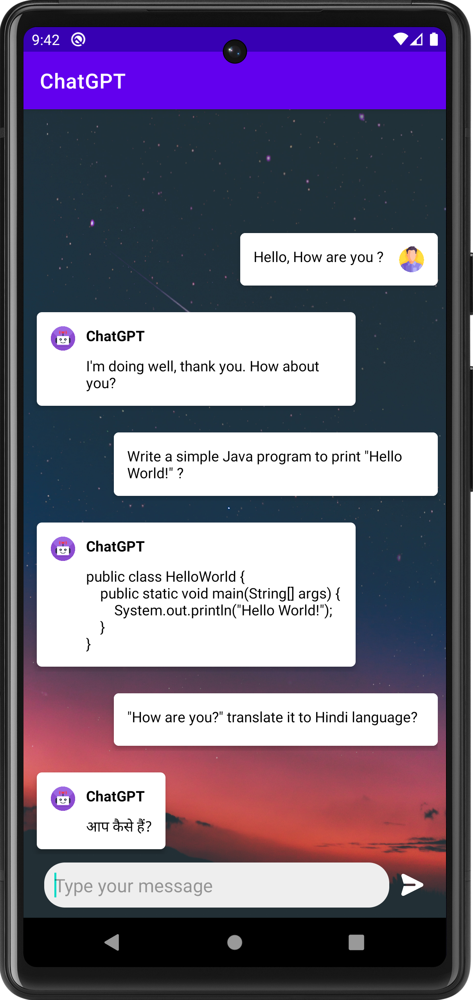
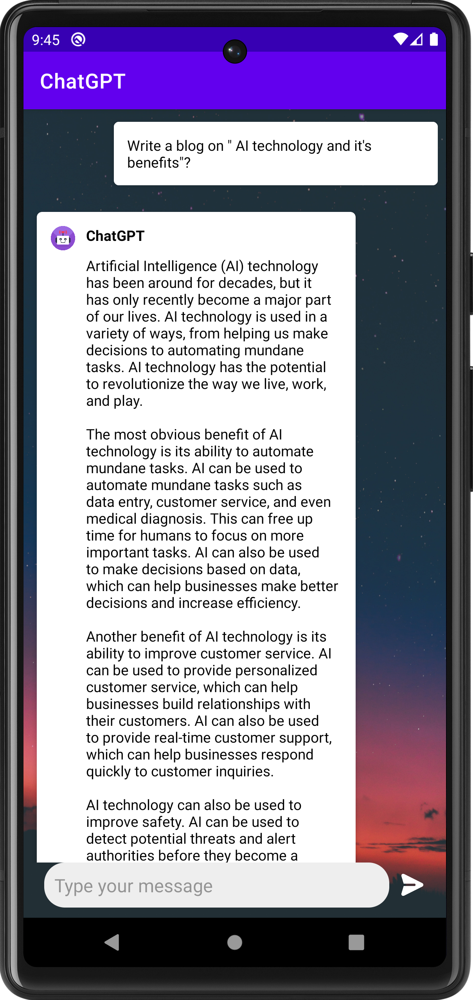
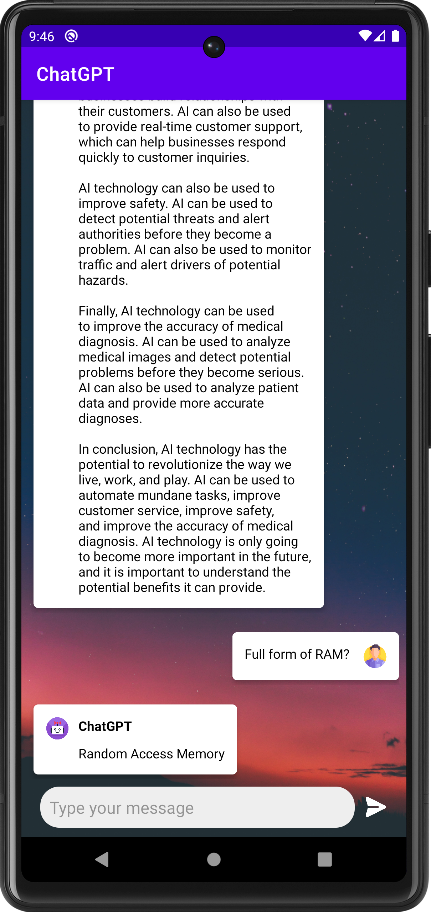
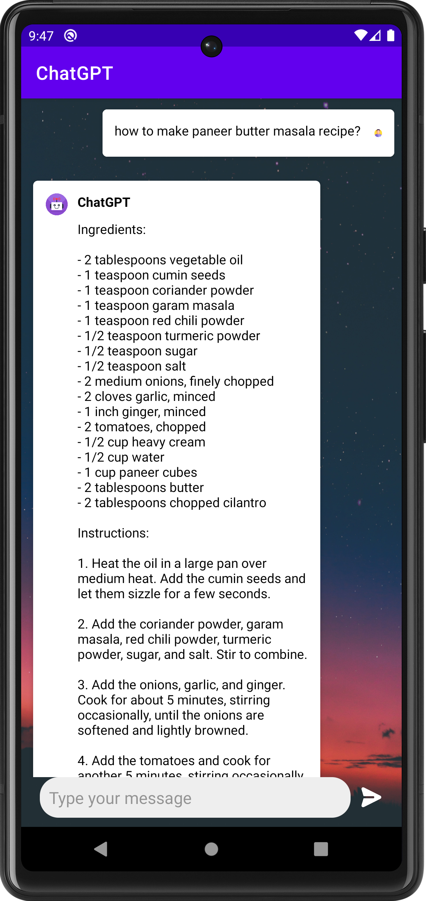
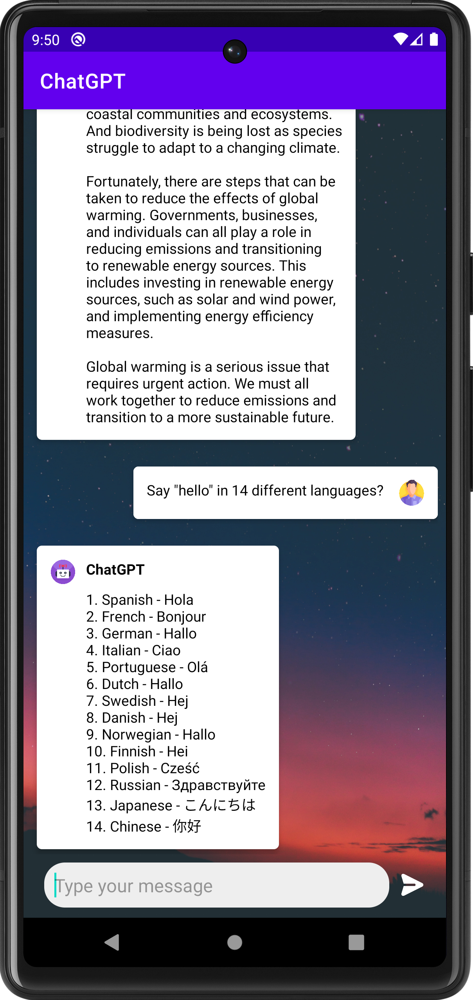

# Android-ChatGPT-AI

🤖 Say hello to Chatbot AI, the innovative chatbot that allows you to easily ask questions and receive accurate and informative responses in real-time. 
Whether you need help with everyday tasks, want to learn something new, or just want to chat, Chatbot AI has got you covered.

# Instructions 
Open this project on Android Studio, And Use your API key here:

Without API key this app can't work.

This app uses third-party service API ( Open AI API ), you can generate your own API Key from the official website https://platform.openai.com/account/api-keys

<table style="width:100%">
  <tr>
    <th>Example 1</th>
    <th>Example 2</th>
    <th>Example 3</th>
  </tr>
  <tr>
    <td></td>
    <td></td>
    <td></td>
  </tr>
  <tr>
    <th>Example 4</th>
    <th>Example 5</th>
    <th>Example 6</th>
  </tr>
  <tr>
    <td></td>
    <td></td>
    <td></td>
  </tr>
 
</table>
 
